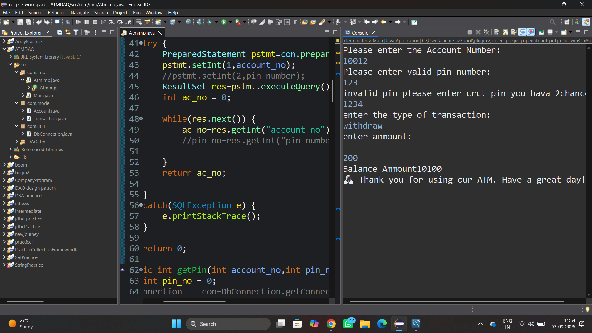
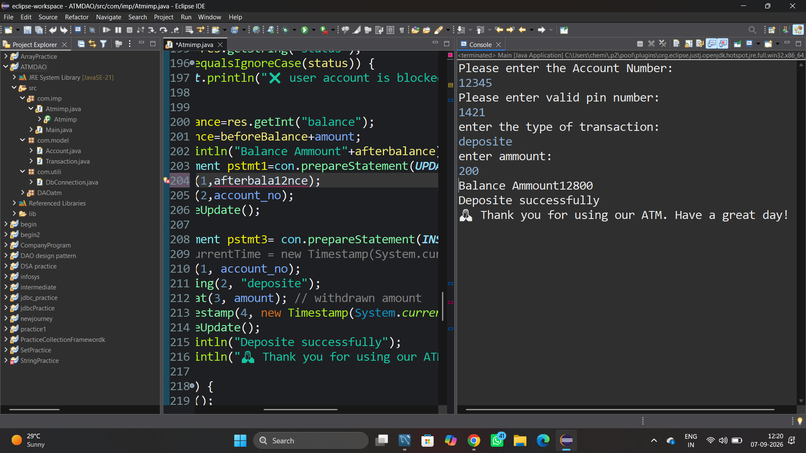

# 🏧 ATM Machine Management System

**Core Java · JDBC · MySQL Console Application**

---

## 📌 Project Overview
This project is a console-based ATM Management System built using Core Java and JDBC, connected to a MySQL database. It lets a bank customer log in with an account number and PIN to check balance, withdraw, deposit, and change PIN, while blocked accounts are automatically restricted from transactions.

---

## 🛠 1. Skills Used
- Core Java — OOP concepts, interfaces (`DAOatm.Methods`), control flow, exception handling
- JDBC (Java Database Connectivity) — `PreparedStatement`, `ResultSet`, `Connection` management
- MySQL — schema design, DML/DDL, querying via MySQL Workbench
- Eclipse IDE — project structuring, debugging, console-based I/O testing
- DAO Design Pattern — separating data-access logic (`Atmimp`) from the interface contract (`Methods`)
- Java Collections & Scanner — reading user input, controlling transaction flow
- Git & GitHub — version control and project hosting

---

## 🗄 2. Database Tables

### `account`
| Column | Type | Description |
|---|---|---|
| account_no | INT (PK) | Unique account number, entered at login |
| holdername | VARCHAR | Name of the account holder |
| pin_number | INT | 4-digit PIN used for authentication |
| balance | DECIMAL | Current available balance |
| status | VARCHAR | Active / blocked — controls transaction access |

*Fig 1 — account table data viewed in MySQL Workbench*

### `transaction`
| Column | Type | Description |
|---|---|---|
| transaction_id | INT (PK) | Auto-generated ID for each transaction |
| account_no | INT (FK) | References account.account_no |
| type | VARCHAR | withdraw / deposite |
| amount | FLOAT | Transaction amount |
| time | TIMESTAMP | Date and time of the transaction |

*Fig 2 — transaction table logging every withdraw/deposit*

---

## 💻 3. Platforms and Versions
| Component | Details |
|---|---|
| Language | Java (JDK 21 — JavaSE-21) |
| IDE | Eclipse IDE |
| Database | MySQL 8.0 |
| DB Client | MySQL Workbench |
| Connectivity | JDBC (java.sql package) |
| Project structure | Eclipse Java Project (.classpath / .project) |
| Version control | Git & GitHub |

---

## ⚙️ 5. Features

### 🔐 Account Login with PIN Verification
User enters an account number and PIN. The system validates credentials against the `account` table and allows up to 3 attempts before the account is auto-blocked.

*Fig 3 — Login flow showing invalid-PIN retry (2 chances remaining) before proceeding to a transaction*

### 💰 Balance Enquiry
Fetches and displays the current balance for the logged-in account.

*Fig 4 — Balance check flow in the console*

### 💵 Withdraw Money
Validates the amount (must be positive and not exceed the available balance), deducts it from the balance, and logs the transaction.

*Fig 5 — Withdraw transaction with PIN-retry handling*

### 💳 Deposit Money
Adds the entered amount to the account balance and logs it in the `transaction` table.

*Fig 6 — Deposit transaction flow*

### 🔑 Change PIN
Allows the account holder to update their PIN number in the database.

<!-- Add a "change pin.png" screenshot to your repo and use this line:

*Fig 7 — Change PIN flow* -->

### ⭐ New Feature — Active/Blocked Account Restriction
The system now checks the account's `status` column before processing any withdrawal or deposit.
- ✅ **Active account** → withdraw/deposit executes normally
- ❌ **Blocked account** → transaction is rejected with: *"❌ Your account is blocked. Please contact the bank for assistance."*
- No balance update or transaction record is created when blocked.

*Fig 8 — Deposit attempt correctly blocked for a blocked-status account*

---

## 🔄 7. Project Flow
1. User runs the application and enters their account number.
2. System looks up the account and prompts for the PIN.
3. PIN is verified — up to 3 attempts allowed; on the 3rd failure the account is blocked.
4. On successful login, user selects a transaction type: `withdraw`, `deposite`, `balance`, or `changepin`.
5. Before withdraw/deposit executes, the account status is checked (Active vs blocked).
6. If active, the transaction is processed: balance is updated and a row is inserted into the `transaction` table.
7. If blocked, the operation is stopped and the user is notified to contact the bank.
8. Result (new balance / confirmation / error) is printed to the console.

*Fig 9 — Account state before a transaction*

*Fig 10 — Account state after the transaction (balance updated in MySQL)*

---

## 🌟 8. Project Highlights
- Clean separation of concerns using a DAO interface (`Methods`) implemented by `Atmimp`.
- All SQL access uses `PreparedStatement` — protects against SQL injection.
- Every withdraw/deposit is logged with a timestamp in a dedicated `transaction` table for auditability.
- Security-style PIN-retry mechanism: 3 wrong attempts auto-blocks the account.
- Newly added account-status guard (Active/blocked) enforces business rules directly at the data layer before any balance mutation.
- Simple, readable console UX with clear success/error messages (including emoji-based cues).
- Lightweight, dependency-minimal stack (Core Java + JDBC + MySQL) — easy to run and extend.
